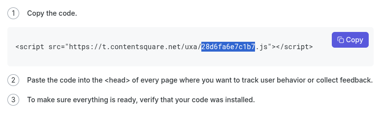

<div align="center">
  <h1 id="main">storybook-addon-contentsquare</h1>

  <picture style="display: flex; flex-direction: column; align-items: center;">
    
  </picture>
</div>

------

Run [Contentsquare Web tracking](https://docs.contentsquare.com/en/web/) and [Hotjar insights feedback forms](https://www.hotjar.com/survey-templates/product-feedback/) on your [Storybook](https://storybook.js.org) server to understand your users' behaviour.

## Getting Started

### Setup Contentsquare

First, create your project in Contentsquare.

> [!CAUTION]
> When you create your project, make sure to point to your production website URL. It appears you cannot track multiple URLs or domains with Contentsquare, and you must create a new project every time you change your URL.

Once you've created your project, visit [this page](https://app.contentsquare.com/#/get-started) and copy the hash-looking filename appearing in the code block.

<picture style="display: flex; flex-direction: column; align-items: start;">
  
</picture>


### Install addon
Install:

```sh
yarn add -D storybook-addon-contentsquare
```

```sh
npm install -D storybook-addon-contentsquare
```

```sh
pnpm install -D storybook-addon-contentsquare
```

### Configure addon
In your `.storybook/main.ts` file, add the following:

```ts
// .storybook/main.ts
export default {
  addons: ['storybook-addon-contentsquare'],
}
```

In your `.storybook/manager.ts` file, add the following config, reusing the tagId you found in your Cntentsquare settings:

```ts
// .storybook/manager.ts
import { addons } from 'storybook/manager-api'

addons.setConfig({
  contentsquare: {
    tagId: '28d6fa6e7c1b7',
  },
})
```

If you would like to store your `tagId` in an [environment variable](https://storybook.js.org/docs/react/configure/environment-variables) so it is not available in your repo, add an `.env` file to the root of your project or set an environment variable in your CI:

```
STORYBOOK_CONTENTSQUARE_TAG_ID = 28d6fa6e7c1b7
```

And reference tat variable in `.storybook/manager.ts`:

```ts
// .storybook/manager.ts
import { addons } from 'storybook/manager-api'

addons.setConfig({
  contentsquare: {
    tagId: process.env.STORYBOOK_CONTENTSQUARE_TAG_ID,
  },
})
```

## Consent UI

This addon requests user consent to track their activity. Contentsquare stores a cookie to record when users opted out from analytics, and this addon stores a key in `localStorage` recording whether the user previously gave or denied consent, to show a consent dialog UI when necessary.

### Force tracking without consent

The addon always instructions Contentsquare to disable tracking until the user explicitly consented. If instead you are in a context where there is no privacy law, or when there is a valid legal basis for tracking and users are informed of it, you can force tracking on your Storybook instance:

```ts
// .storybook/manager.ts

import { addons } from 'storybook/manager-api'

addons.setConfig({
  contentsquare: {
    iWantToViolatePrivacyLawsAndSpyOnMyColleaguesWithoutTheirConsent: true,
  },
})
```

### Localisation

You can customise the labels used in the consent UI, both before consent has been provided and after:

```ts
// .storybook/manager.ts

import { addons } from 'storybook/manager-api'

addons.setConfig({
  contentsquare: {
    consentTitle: 'Analytics Consent Dialog',
    initialConsentDesc: 'You have not yet accepted or refused analytics cookies.',
    initialAcceptLabel: 'Allow cookies',
    initialRefuseLabel: 'Refuse cookies',
    optedInDesc: 'You have accepted cookies.',
    optedOutDesc: 'You have refused cookies.',
    acceptLabel: 'Accept cookies from now on',
    refuseLabel: 'Refuse cookies from now on',
  },
})
```

## Feedback buttons

Installing the addon allows the use of Hotjar feedback buttons. Go to the [Hotjar app](https://insights.hotjar.com/) and create a survey of type 'feedback button'. Once enabled, it should appear on your Storybook instance.

## Limitations
This addon is limited in what it can record because of potential bugs and limitations in Contentsquare.

### Timing of page view events

Contentsquare does not always process `trackPageview` events and seemingly records page views whenever it wants (even when I never actually send `trackPageview` events). It seems to me whenever users navigate on a new page, Contentsquare tracks the *previous* page load. Contentsquare only records the *current* page load when events are fired manually from the DevTools console. I don't have time to debug this behaviour any further.

Within the addon codebase, all Storybook lifecycle hooks are connected to the right callbacks to turn Storybook metadata into [custom vars](https://docs.contentsquare.com/en/web/sending-custom-vars/). This is disabled until someone finds a way to force Contentsquare events to record the current event. PRs are welcome.

### Iframe tracking

The Contentsquare documentation on [iframe support](https://docs.contentsquare.com/en/web/compatibility/#session-replay-and-iframes) is incomplete, and does not actually explain how Contentsquare users can enable `iFrameTracking`. Until that happens, support for heatmaps or in-page events is limited to the Storybook UI. No support will be provided and no PR will be accepted on this scope.

## Contributing

### Code of Conduct

Please read the [Code of Conduct](https://github.com/storybook-community/storybook-addon-contentsquare/blob/main/CODE_OF_CONDUCT.md) first.

### Developer Certificate of Origin

To ensure that contributors are legally allowed to share the content they contribute under the license terms of this project, contributors must adhere to the [Developer Certificate of Origin](https://developercertificate.org/) (DCO). All contributions made must be signed to satisfy the DCO. This is handled by a Pull Request check.

> By signing your commits, you attest to the following:
>
> 1. The contribution was created in whole or in part by you and you have the right to submit it under the open source license indicated in the file; or
> 2. The contribution is based upon previous work that, to the best of your knowledge, is covered under an appropriate open source license and you have the right under that license to submit that work with modifications, whether created in whole or in part by you, under the same open source license (unless you are permitted to submit under a different license), as indicated in the file; or
> 3. The contribution was provided directly to you by some other person who certified 1., 2. or 3. and you have not modified it.
> 4. You understand and agree that this project and the contribution are public and that a record of the contribution (including all personal information you submit with it, including your sign-off) is maintained indefinitely and may be redistributed consistent with this project or the open source license(s) involved.

### Getting Started

This project uses PNPM as a package manager.

- See the [installation instructions for PNPM](https://pnpm.io/installation)
- Run `pnpm i`

### Useful commands

- `pnpm start` starts the local Storybook
- `pnpm build` builds and packages the addon code
- `pnpm pack:local` makes a local tarball to be used as a NPM dependency elsewhere
- `pnpm test` runs unit tests

### Migrating to a later Storybook version

If you want to migrate the addon to support the latest version of Storyboook, you can check out the [addon migration guide](https://storybook.js.org/docs/addons/addon-migration-guide).

### Release System

This package auto-releases on pushes to `main` with [semantic-release](https://github.com/semantic-release/semantic-release). No changelog is maintained and the version number in `package.json` is not synchronised.

## Support

Please [open an issue](https://github.com/storybook-community/storybook-addon-contentsquare/issues/new) for bug reports or code suggestions. Make sure to include a working Minimal Working Example for bug reports. You may use [storybook.new](https://new-storybook.netlify.app/) to bootstrap a reproduction environment.
